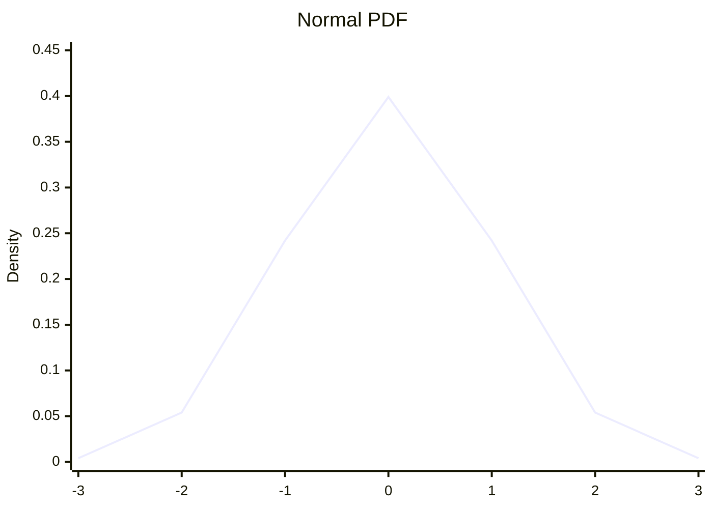
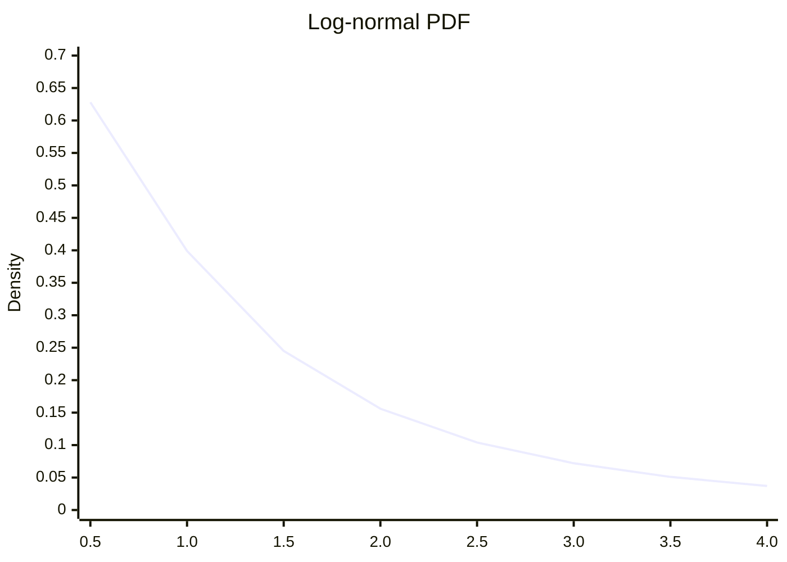
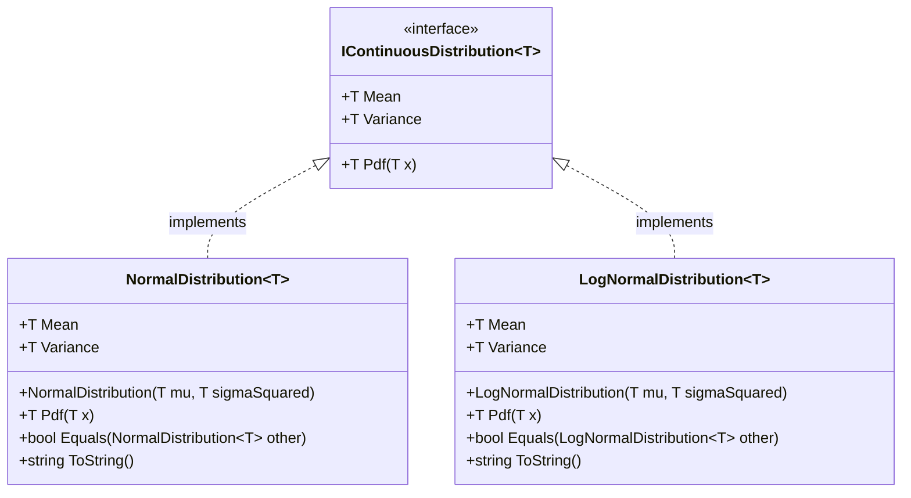

# continuous-distributions

[](https://codecov.io/gh/kolvin/continuous-distributions)
[](https://conventionalcommits.org)

<!-- START doctoc generated TOC please keep comment here to allow auto update -->
<!-- DON'T EDIT THIS SECTION, INSTEAD RE-RUN doctoc TO UPDATE -->
## Contents

- [Overview](#overview)
- [Explain it like I'm 5](#explain-it-like-im-5)
- [Normal distribution](#normal-distribution)
- [Log-normal distribution](#log-normal-distribution)
- [Architecture](#architecture)
- [Requirements](#requirements)
- [Installation](#installation)
- [Usage](#usage)
    - [Polymorphic usage](#polymorphic-usage)
    - [Float precision](#float-precision)
    - [Console application](#console-application)
- [Roadmap](#roadmap)
- [Releases](#releases)
- [Resources](#resources)

<!-- END doctoc generated TOC please keep comment here to allow auto update -->

A C# library of continuous probability distributions.

## Overview

This library provides a shared interface for continuous probability distributions, making it straightforward to work with different distributions in a consistent, polymorphic way.

Both distributions are generic over `IFloatingPointIeee754<T>`, so they work with `double`, `float`, or any other IEEE 754 floating-point type — no code duplication required.

## Explain it like I'm 5

Imagine you measured the height of every person in your school and drew a dot for each one on a long piece of paper. Most dots would pile up in the middle (average height) with fewer dots out at the very short or very tall ends. That pile of dots forms a shape — and that shape is called a **distribution**.

A **probability distribution** is just a mathematical description of that shape. It tells you: for any value you pick, how likely is it to appear?

The **PDF (Probability Density Function)** is the formula that draws the curve of that shape. Call `Pdf(x)` and it tells you how dense — how many data points pile up — right at the value `x`.

**Normal distribution** — the classic symmetric bell curve. Most things in nature cluster around an average and spread out evenly on both sides. Heights, test scores, measurement errors — they all tend to follow this shape.

**Log-normal distribution** — like the Normal, but for things that grow by multiplying rather than adding. Stock prices, salaries, and website response times can't go below zero and tend to have a long right tail (a few very large values). If you take the logarithm of those values, they look Normal — hence *log*-normal.

## Normal distribution

> [Wikipedia — Normal distribution](https://en.wikipedia.org/wiki/Normal_distribution)

The **Normal (Gaussian) distribution** is the symmetric bell curve. It appears wherever many small independent random effects add together — by the [Central Limit Theorem](https://en.wikipedia.org/wiki/Central_limit_theorem), the sum of almost any large collection of random values converges to a Normal distribution.

**Parameters**

| Parameter | Symbol | Meaning |
|---|---|---|
| `mu` | μ | Centre of the bell curve |
| `sigmaSquared` | σ² | Width of the spread (must be > 0) |

**PDF shape** (μ = 0, σ² = 1)



**Real-world uses**

- **Finance** — modelling daily stock returns around an expected value
- **Quality control** — measuring manufacturing tolerances (e.g. component dimensions)
- **A/B testing** — estimating the probability one variant outperforms another
- **Machine learning** — Gaussian Naive Bayes, neural network weight initialisation
- **Population biology** — modelling height, weight, and other natural measurements

**Code example**

```csharp
using Distributions;

var dist = new NormalDistribution<double>(mu: 3, sigmaSquared: 1.5);

Console.WriteLine(dist.Pdf(3.6));   // 0.28890103549202527
Console.WriteLine(dist.Mean);       // 3
Console.WriteLine(dist.Variance);   // 1.5
Console.WriteLine(dist);            // Normal(μ=3, σ²=1.5)
```

---

## Log-normal distribution

> [Wikipedia — Log-normal distribution](https://en.wikipedia.org/wiki/Log-normal_distribution)

The **Log-normal distribution** describes data whose *logarithm* is normally distributed. It is right-skewed and bounded at zero, making it the natural choice for quantities that can only be positive and vary multiplicatively — where percentage changes matter more than absolute ones.

**Parameters**

| Parameter | Symbol | Meaning |
|---|---|---|
| `mu` | μ | Mean of the underlying normal (in log-space) |
| `sigmaSquared` | σ² | Variance of the underlying normal (must be > 0) |

**PDF shape** (μ = 0, σ² = 1)



**Real-world uses**

- **Finance** — stock price modelling (Black-Scholes assumes log-normal returns)
- **Income distribution** — income in most economies follows a log-normal pattern
- **Reliability engineering** — time-to-failure for hardware components
- **Web performance** — HTTP response latency is typically log-normally distributed
- **Environmental science** — particle sizes, rainfall amounts, pollutant concentrations

**Code example**

```csharp
using Distributions;

var dist = new LogNormalDistribution<double>(mu: 3, sigmaSquared: 1.5);

Console.WriteLine(dist.Pdf(3.6));   // 0.033787385801803826
Console.WriteLine(dist.Mean);       // 42.52108200006278
Console.WriteLine(dist.Variance);   // 6295.041513119321
Console.WriteLine(dist);            // Log-normal(μ=3, σ²=1.5)
```

---

## Architecture



`T` is constrained to [`IFloatingPointIeee754<T>`](https://learn.microsoft.com/en-us/dotnet/api/system.numerics.ifloatingpointieee754-1) — both `double` and `float` satisfy this, so either can be used as the type argument with no code changes.

## Requirements

- [.NET 10 SDK](https://aka.ms/dotnet/download)

## Installation

Packages are published to [GitHub Packages](https://github.com/kolvin/continuous-distributions/pkgs/nuget/Distributions). First add the source:

```sh
dotnet nuget add source \
  --username <your-github-username> \
  --password <your-github-token> \
  --store-password-in-clear-text \
  --name github \
  "https://nuget.pkg.github.com/kolvin/index.json"
```

Then add the package:

```sh
dotnet add package Distributions
```

## Usage

### Polymorphic usage

Both distributions implement `IContinuousDistribution<T>`, so they can be used interchangeably:

```csharp
using Distributions;

IContinuousDistribution<double>[] distributions =
[
    new NormalDistribution<double>(mu: 0, sigmaSquared: 1),
    new LogNormalDistribution<double>(mu: 0, sigmaSquared: 1),
];

foreach (var dist in distributions)
{
    Console.WriteLine($"{dist} → Pdf(1.0) = {dist.Pdf(1.0):F4}");
}
```

### Float precision

For performance-sensitive paths, use `float` instead of `double`:

```csharp
using Distributions;

var dist = new NormalDistribution<float>(mu: 3f, sigmaSquared: 1.5f);
Console.WriteLine(dist.Pdf(3.6f));
```

### Console application

The included CLI prints both distributions for given parameters:

```sh
dotnet run --project Distributions.Console -- <mu> <sigmaSquared> <x>
```

```sh
$ dotnet run --project Distributions.Console -- 3 1.5 3.6
Normal(3.6;3,1.5) = 0.2889010354920253 (Mean : 3, Variance : 1.5)
Log-normal(3.6;3,1.5) = 0.03378738580180383 (Mean : 42.52108200006278, Variance : 6295.041513119321)
```

## Roadmap

- [x] `IContinuousDistribution` interface
- [x] `NormalDistribution` implementation
- [x] `LogNormalDistribution` implementation
- [x] Unit, integration and functional test suite
- [x] CLI console application
- [x] CI pipeline with lint, static analysis, test, and semantic-release
- [x] Branch protection and PR workflow

## Releases

Versioning is handled automatically by [semantic-release](https://semantic-release.gitbook.io) on every push to `main`. Commit messages must follow [Conventional Commits](https://www.conventionalcommits.org):

| Prefix | Effect |
|---|---|
| `feat:` | minor version bump |
| `fix:` | patch version bump |
| `feat!:` or `BREAKING CHANGE:` | major version bump |
| `chore:`, `docs:`, `test:` | no release |

## Resources

**Probability theory**
- [Wikipedia — Probability density function](https://en.wikipedia.org/wiki/Probability_density_function)
- [Wikipedia — Continuous probability distribution](https://en.wikipedia.org/wiki/Probability_distribution#Continuous_probability_distribution)
- [Khan Academy — Random variables and probability distributions](https://www.khanacademy.org/math/statistics-probability/random-variables-stats-library)

**Normal distribution**
- [Wikipedia — Normal distribution](https://en.wikipedia.org/wiki/Normal_distribution)
- [Wikipedia — Central Limit Theorem](https://en.wikipedia.org/wiki/Central_limit_theorem)
- [Wolfram MathWorld — Normal distribution](https://mathworld.wolfram.com/NormalDistribution.html)
- [3Blue1Brown — But what is the Central Limit Theorem?](https://www.youtube.com/watch?v=zeJD6dqJ5lo)

**Log-normal distribution**
- [Wikipedia — Log-normal distribution](https://en.wikipedia.org/wiki/Log-normal_distribution)
- [Wolfram MathWorld — Log-normal distribution](https://mathworld.wolfram.com/LogNormalDistribution.html)
- [Wikipedia — Black-Scholes model](https://en.wikipedia.org/wiki/Black%E2%80%93Scholes_model)

**.NET generic math**
- [Microsoft Docs — Generic math in .NET](https://learn.microsoft.com/en-us/dotnet/standard/generics/math)
- [Microsoft Docs — `IFloatingPointIeee754<T>`](https://learn.microsoft.com/en-us/dotnet/api/system.numerics.ifloatingpointieee754-1)
